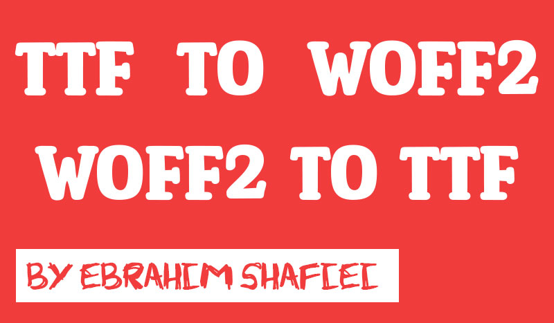

# Abdal TTF WOFF2


# 🤵 برنامه نویس و توسعه دهنده
ابراهیم شفیعی

ایمیل :  Prof.Shafiei@Gmail.com

## ترجمه های این سند
- [English](README.md)
- [فارسی](README.fa.md)

 ## 💎 هدف اصلی🔥 درباره پروژه
در پروژه woff2 شرکت گوگل نسخه ویندوزی وجود ندارد ، برای همین من نسخه ویندوز ساختم . علاوه بر این نسخه لینکس هم کامپیال شده آماده شده است.

# ✨ امکانات 
- تبدیل TTF fonts به WOFF2
- تبدیل WOFF2 به TTF fonts
- نسخه کامپایل شده ویندوزی
- نسخه کامپایل شده لینوکسی
- کاملا متن باز


اگر مثل من به پروژه های آزاد و کمک به مردم جهان علاقه دارید پیام دهید تا با هم جهانی بهتر بسازیم.


# 💡 نحوه استفاده بر روی لینوکس

```shell
chmod +x  woff2_compress
chmod +x  woff2_decompress
chmod +x  woff2_info
```


> ./woff2_compress  font.ttf

> ./woff2_decompress  font.woff2

> ./woff2_info  font.woff2

# 💡 نحوه استفاده بر روی ویندوز

> woff2_compress.exe  font.ttf

> woff2_decompress.exe  font.woff2

> woff2_info.exe  font.woff2


## ✅  سیستم عامل های پشتیبان شده

- Debian
- Ubuntu
- Centos
- Fedora
- RedHat
- Windows 10
- Windows 11
- Windows 7
- All Windows Server

 

# 🧲 پروژه های مرتبط
[Google Woff2](https://github.com/google/woff2)

 
 ## ⚠️ سلب مسئولیت قانونی ⚠️

پروژه  abdal-ttf-woff2 یک تولید بر مبنای استفاده صحیح جهت پیشرفت های علمی می باشد ، هرگونه استفاده مخرب از این سیستم خارج از قوانین محلی کشور شما از عهده و مسئولین سازنده و برنامه نویس پروژه و تیم ابدال خارج است . 

## ❤️ کمک ها مالی به پروژه 

> USDT:      TKRmTvwkMFdgGrwvDHztLXsKAwK2WEEKUp

> bitcoin:   bc1q9w9ymgz2wluax60rsuza4q0at7gpy82g8el6zj

> For Iranian People -> MellatBank : 6104-3378-5301-4247

## ❗ گزارش خطا در این پروژه 

 اگر باخطایی مواجه شدید لطفاً به Prof.Shafiei@Gmail.com گرازش کنید تا ما در کمترین زمان آن خطا را رفع کنیم


